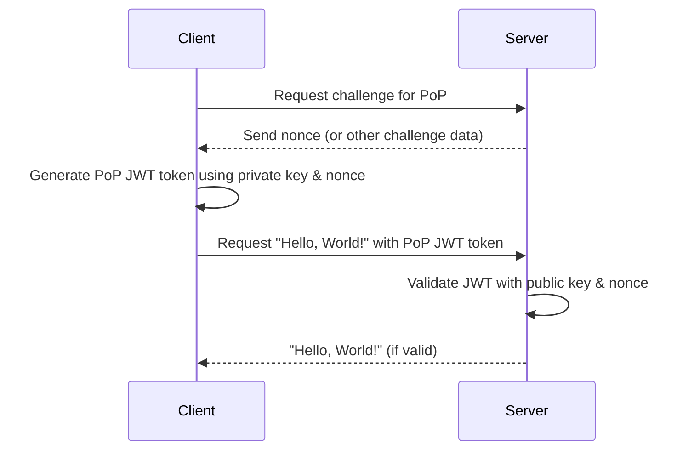

# POPDropwizard

POP (Proof of possession) security in a dropwizard application. 

## Description
The purpose of this is to demonstrate POP tokens. Dropwizard in this context is any rest service. I 'm using java because most examples are in .net. 

## Setup

1. Generate Certificates
For simplicity, you can use the Java Keytool to create a keystore with the client's private key and public key:

keytool -genkeypair -v -keystore client-keystore.jks -keyalg RSA -keysize 2048 -validity 365 -alias clientkey

_This will generate a keystore client-keystore.jks that contains the client's private and public key._


## Dropwizard applciation

Firstly, you'll need to include some dependencies in your pom.xml for Dropwizard and JWT:

### pom files

```xml
<!-- Dropwizard dependencies -->
<dependency>
    <groupId>io.dropwizard</groupId>
    <artifactId>dropwizard-core</artifactId>
    <version>2.0.25</version> <!-- Check for the latest version -->
</dependency>

<!-- JWT -->
<dependency>
    <groupId>io.jsonwebtoken</groupId>
    <artifactId>jjwt-api</artifactId>
    <version>0.11.2</version>
</dependency>
<dependency>
    <groupId>io.jsonwebtoken</groupId>
    <artifactId>jjwt-impl</artifactId>
    <version>0.11.2</version>
    <scope>runtime</scope>
</dependency>
<dependency>
    <groupId>io.jsonwebtoken</groupId>
    <artifactId>jjwt-jackson</artifactId>
    <version>0.11.2</version> 
    <scope>runtime</scope>
</dependency>

```

### dropwizard resource

```java
package com.example;

import io.jsonwebtoken.Jwts;
import io.jsonwebtoken.SignatureAlgorithm;

import javax.ws.rs.*;
import javax.ws.rs.core.Response;
import java.io.FileInputStream;
import java.security.KeyStore;
import java.security.PublicKey;
import java.security.Signature;

@Path("/helloworld")
public class HelloWorldResource {
    
    private final PublicKey clientPublicKey;
    
    public HelloWorldResource() throws Exception {
        KeyStore ks = KeyStore.getInstance("JKS");
        ks.load(new FileInputStream("client-keystore.jks"), "password".toCharArray());
        clientPublicKey = ks.getCertificate("clientkey").getPublicKey();
    }

    @GET
    public Response getHelloWorld(@HeaderParam("Authorization") String authHeader) {
        if (authHeader == null || !authHeader.startsWith("Bearer ")) {
            return Response.status(Response.Status.UNAUTHORIZED).build();
        }
        String jwt = authHeader.substring("Bearer ".length());

        try {
            Jwts.parser().setSigningKey(clientPublicKey).parseClaimsJws(jwt);
            return Response.ok("Hello, World!").build();
        } catch (Exception e) {
            return Response.status(Response.Status.UNAUTHORIZED).entity("Invalid PoP token").build();
        }
    }
}

```
### HelloWorldApplication.java

```java
package com.example;

import io.dropwizard.Application;
import io.dropwizard.setup.Bootstrap;
import io.dropwizard.setup.Environment;

public class HelloWorldApplication extends Application<HelloWorldConfiguration> {

    public static void main(final String[] args) throws Exception {
        new HelloWorldApplication().run(args);
    }

    @Override
    public void initialize(final Bootstrap<HelloWorldConfiguration> bootstrap) {
        // Initialization code
    }

    @Override
    public void run(final HelloWorldConfiguration configuration, final Environment environment) {
        final HelloWorldResource resource = new HelloWorldResource();
        environment.jersey().register(resource);
    }
}


```

### Configuration

```java 
package com.example;

import io.dropwizard.Configuration;

public class HelloWorldConfiguration extends Configuration {
    // Dropwizard configuration class
}

```

### client

```java
package com.example;

import io.jsonwebtoken.Jwts;
import io.jsonwebtoken.SignatureAlgorithm;

import java.io.FileInputStream;
import java.net.HttpURLConnection;
import java.net.URL;
import java.security.KeyStore;
import java.security.PrivateKey;

public class ClientApp {
    
    public static void main(String[] args) throws Exception {
        KeyStore ks = KeyStore.getInstance("JKS");
        ks.load(new FileInputStream("client-keystore.jks"), "password".toCharArray());
        PrivateKey clientPrivateKey = (PrivateKey) ks.getKey("clientkey", "password".toCharArray());

        String jwt = Jwts.builder()
                .setSubject("Client")
                .signWith(clientPrivateKey, SignatureAlgorithm.RS256)
                .compact();

        URL url = new URL("http://localhost:8080/helloworld");
        HttpURLConnection conn = (HttpURLConnection) url.openConnection();
        conn.setRequestMethod("GET");
        conn.setRequestProperty("Authorization", "Bearer " + jwt);

        int responseCode = conn.getResponseCode();
        if (responseCode == HttpURLConnection.HTTP_OK) {
            String responseMessage = new String(conn.getInputStream().readAllBytes());
            System.out.println("Server Response: " + responseMessage);
        } else {
            System.out.println("Failed to get a response from the server.");
        }
    }
}

```

## Setup 
With the above setup, the client signs a JWT using its private key. The Dropwizard server then verifies the JWT using the client's public key. If verification succeeds, the server responds with "Hello, World!"

To run:

Start the Dropwizard server using HelloWorldApplication.java.
Run the client using ClientApp.java.
This should give you a running and debuggable system locally to understand PoP using JWT.

I'm using vs code, and didn't want the archtype because they can create things I don't understand, and then i usually stumble. This is how i started the project. 

#!/bin/bash

# Create the Maven project structure
mkdir -p src/main/java/com/example

# Touch the Java files
touch src/main/java/com/example/HelloWorldApplication.java
touch src/main/java/com/example/HelloWorldConfiguration.java
touch src/main/java/com/example/HelloWorldResource.java
touch src/main/java/com/example/ClientApp.java

# Create the Maven pom.xml
touch pom.xml

# Generate client keystore
keytool -genkeypair -v -keystore client-keystore.jks -keyalg RSA -keysize 2048 -validity 365 -alias clientkey -storepass password -keypass password -dname "CN=Client, OU=Example, O=Example, L=City, ST=State, C=US"

# Provide feedback about what was created
echo "Files and directories have been set up. Make sure to populate the pom.xml and Java files with the content provided earlier."


## Running project

mvn clean package

if you want to run from maven
mvn exec:java 

if you want to run from java
java -jar target/pop-example-1.0-SNAPSHOT.jar server

launching client. 
java -cp target/pop-example-1.0-SNAPSHOT.jar com.example.ClientApp





## general notes about token types in this space

# Token-Based Authentication: PoP vs PFT

## Proof-of-Possession (PoP) Tokens

### Pros:

- **Cryptographic Non-Repudiation:** PoP tokens provide cryptographic assurance that the client presenting the token is indeed the same one the token was issued to.
- **Widely Recognized:** Many modern standards and systems have begun incorporating PoP mechanisms, making it a well-understood concept in security circles.
- **Resistance to Token Replay Attacks:** Even if a malicious actor intercepts a PoP token, they cannot successfully use it without the corresponding private key.

### Cons:

- **Computational Overhead:** Asymmetric cryptographic operations (like signing and verifying) can be computationally intensive, especially on constrained devices.
- **Complexity:** Implementing PoP might require more intricate setup and handling, like key management and token generation/verification logic.

## Protected Forward Token (PFT)

### Pros:

- **Client-specific Binding:** PFT binds a token to a specific client instance or session, making it less useful if stolen.
- **Potentially Lower Overhead:** Does not always require asymmetric cryptography, which might be beneficial in environments with limited computational resources.
- **Flexibility:** Allows for various client-specific binding mechanisms, depending on the implementation.

### Cons:

- **Lesser Non-Repudiation:** Does not provide the same level of cryptographic assurance as PoP tokens.
- **Dependence on Client Properties:** The security of PFT depends on the uniqueness and immutability of the client properties it's tied to.

## Mutual TLS (mTLS)

mTLS, or mutual authentication TLS, is a protocol where both client and server authenticate each other. It enhances security by ensuring two-way verification:

- **Client Verification:** In addition to servers presenting a certificate to authenticate themselves to clients (as in regular TLS), clients also present a certificate to authenticate themselves to servers.
  
- **Use with Tokens:** mTLS can be combined with either PoP or PFT tokens to provide an additional layer of security. By ensuring that both the client and server are who they say they are at the transport layer, you add a robust first line of defense against man-in-the-middle and impersonation attacks.


## how pop prevents replay attacks.

How PoP Prevents Replay Attacks
Binding of Token to Key Pair: A PoP token is associated with a specific public/private key pair. This means that possession of the token alone is not enough; the client must also possess the private key associated with the token to use it. This reduces the risk of token theft.

Timestamps & Token Expiry: PoP tokens can be combined with timestamps or nonce values, making them valid only for a short duration. This restricts the timeframe in which a replay attack can occur.

Nonce & Server State: By using a nonce (a random value) that's sent by the client during token acquisition and stored server-side with the token, the server can ensure the token is only used once. If another request arrives with the same nonce, it's recognized as a replay and denied.

Server State Tracking: Some implementations might keep track of used tokens (or associated nonces) for a limited duration, ensuring the same token cannot be used twice.

## How the Nonce Works:
Generation: The client generates a unique nonce for each request. This nonce should be unpredictable.
Inclusion in the Request: The nonce is included as part of the request.
Signature: The nonce is also included in what gets signed, ensuring that the nonce itself isn't tampered with during transit.
Verification on the Server: The server checks the signature as before. If the signature is valid, the server then checks if it has seen the nonce before.
If the nonce is new, the server processes the request and then remembers the nonce so it won't accept it again.
If the nonce has been seen before, the server rejects the request.

They're fast, support time-based eviction, and can be scaled across multiple nodes.

Databases: For some systems, especially those that require longer-term retention or analytics, a database might be used. This can be more durable but might be slower than using a cache.

Time-to-live (TTL):
Storing nonces indefinitely is not feasible, so they typically have a TTL associated with them.

Limited Validity Period for Requests: You can ensure that each request (or the associated token) has a short validity period. For example, it might only be valid for 5 minutes.

Evicting Old Nonces: Both distributed caches and databases support automatic eviction of old entries. In the case of Redis, for instance, you can set a TTL on a key when you add it, and Redis will automatically remove it after that duration.

Dealing with Time:
Server Time Synchronization: If you're using time as a factor, it's essential that servers' clocks are synchronized. This is typically done using protocols like NTP.

Grace Periods: To account for slight differences in server times or network delays, a grace period is often allowed. So if a request claims to be from 2:00 pm, the server might accept it as valid until 2:05 pm.

Distributed Systems Considerations:
Global Nonce Store: If you have multiple instances of a service, they all need to check against a shared nonce store. This is why distributed caches or databases are preferred.

Consistency vs. Availability: In distributed systems, there's often a trade-off between data consistency and system availability (the CAP theorem). Depending on the exact requirements and risks associated with the application, some systems might prioritize ensuring that no nonce is ever accepted twice (strong consistency), while others might prioritize remaining available even if it means a nonce might occasionally slip through.

Data Replication: If using a distributed cache or database, ensure it's set up to replicate data across nodes, so losing one node doesn't mean losing all your recent nonces.

Security Considerations:
Nonce Predictability: Ensure nonces can't be easily predicted. This typically means using cryptographically secure random number generators or similarly secure methods.

Nonce Size: The nonce should be long enough that an attacker can't easily guess it or try all possible nonce values.

In conclusion, while nonces are a powerful tool for preventing replay attacks, they bring with them their own set of challenges, especially in distributed, high-throughput systems. Proper architecture and system design are crucial for ensuring both security and performance.