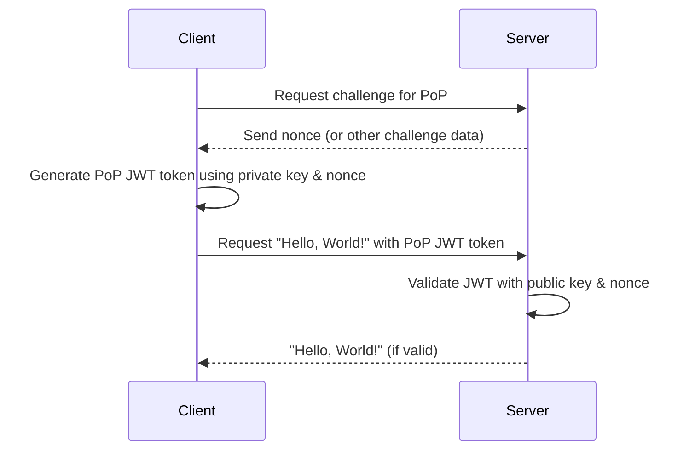

# POPDropwizard

POP (Proof of possession) security in a dropwizard application. 

## Description
The purpose of this is to demonstrate POP tokens. Dropwizard in this context is any rest service. I 'm using java because most examples are in .net. 

## Setup

1. Generate Certificates
For simplicity, you can use the Java Keytool to create a keystore with the client's private key and public key:

keytool -genkeypair -v -keystore client-keystore.jks -keyalg RSA -keysize 2048 -validity 365 -alias clientkey

_This will generate a keystore client-keystore.jks that contains the client's private and public key._


## Dropwizard applciation

Firstly, you'll need to include some dependencies in your pom.xml for Dropwizard and JWT:

### pom files

```xml
<!-- Dropwizard dependencies -->
<dependency>
    <groupId>io.dropwizard</groupId>
    <artifactId>dropwizard-core</artifactId>
    <version>2.0.25</version> <!-- Check for the latest version -->
</dependency>

<!-- JWT -->
<dependency>
    <groupId>io.jsonwebtoken</groupId>
    <artifactId>jjwt-api</artifactId>
    <version>0.11.2</version>
</dependency>
<dependency>
    <groupId>io.jsonwebtoken</groupId>
    <artifactId>jjwt-impl</artifactId>
    <version>0.11.2</version>
    <scope>runtime</scope>
</dependency>
<dependency>
    <groupId>io.jsonwebtoken</groupId>
    <artifactId>jjwt-jackson</artifactId>
    <version>0.11.2</version> 
    <scope>runtime</scope>
</dependency>

```

### dropwizard resource

```java
package com.example;

import io.jsonwebtoken.Jwts;
import io.jsonwebtoken.SignatureAlgorithm;

import javax.ws.rs.*;
import javax.ws.rs.core.Response;
import java.io.FileInputStream;
import java.security.KeyStore;
import java.security.PublicKey;
import java.security.Signature;

@Path("/helloworld")
public class HelloWorldResource {
    
    private final PublicKey clientPublicKey;
    
    public HelloWorldResource() throws Exception {
        KeyStore ks = KeyStore.getInstance("JKS");
        ks.load(new FileInputStream("client-keystore.jks"), "password".toCharArray());
        clientPublicKey = ks.getCertificate("clientkey").getPublicKey();
    }

    @GET
    public Response getHelloWorld(@HeaderParam("Authorization") String authHeader) {
        if (authHeader == null || !authHeader.startsWith("Bearer ")) {
            return Response.status(Response.Status.UNAUTHORIZED).build();
        }
        String jwt = authHeader.substring("Bearer ".length());

        try {
            Jwts.parser().setSigningKey(clientPublicKey).parseClaimsJws(jwt);
            return Response.ok("Hello, World!").build();
        } catch (Exception e) {
            return Response.status(Response.Status.UNAUTHORIZED).entity("Invalid PoP token").build();
        }
    }
}

```
### HelloWorldApplication.java

```java
package com.example;

import io.dropwizard.Application;
import io.dropwizard.setup.Bootstrap;
import io.dropwizard.setup.Environment;

public class HelloWorldApplication extends Application<HelloWorldConfiguration> {

    public static void main(final String[] args) throws Exception {
        new HelloWorldApplication().run(args);
    }

    @Override
    public void initialize(final Bootstrap<HelloWorldConfiguration> bootstrap) {
        // Initialization code
    }

    @Override
    public void run(final HelloWorldConfiguration configuration, final Environment environment) {
        final HelloWorldResource resource = new HelloWorldResource();
        environment.jersey().register(resource);
    }
}


```

### Configuration

```java 
package com.example;

import io.dropwizard.Configuration;

public class HelloWorldConfiguration extends Configuration {
    // Dropwizard configuration class
}

```

### client

```java
package com.example;

import io.jsonwebtoken.Jwts;
import io.jsonwebtoken.SignatureAlgorithm;

import java.io.FileInputStream;
import java.net.HttpURLConnection;
import java.net.URL;
import java.security.KeyStore;
import java.security.PrivateKey;

public class ClientApp {
    
    public static void main(String[] args) throws Exception {
        KeyStore ks = KeyStore.getInstance("JKS");
        ks.load(new FileInputStream("client-keystore.jks"), "password".toCharArray());
        PrivateKey clientPrivateKey = (PrivateKey) ks.getKey("clientkey", "password".toCharArray());

        String jwt = Jwts.builder()
                .setSubject("Client")
                .signWith(clientPrivateKey, SignatureAlgorithm.RS256)
                .compact();

        URL url = new URL("http://localhost:8080/helloworld");
        HttpURLConnection conn = (HttpURLConnection) url.openConnection();
        conn.setRequestMethod("GET");
        conn.setRequestProperty("Authorization", "Bearer " + jwt);

        int responseCode = conn.getResponseCode();
        if (responseCode == HttpURLConnection.HTTP_OK) {
            String responseMessage = new String(conn.getInputStream().readAllBytes());
            System.out.println("Server Response: " + responseMessage);
        } else {
            System.out.println("Failed to get a response from the server.");
        }
    }
}

```

## Setup 
With the above setup, the client signs a JWT using its private key. The Dropwizard server then verifies the JWT using the client's public key. If verification succeeds, the server responds with "Hello, World!"

To run:

Start the Dropwizard server using HelloWorldApplication.java.
Run the client using ClientApp.java.
This should give you a running and debuggable system locally to understand PoP using JWT.

I'm using vs code, and didn't want the archtype because they can create things I don't understand, and then i usually stumble. This is how i started the project. 

#!/bin/bash

# Create the Maven project structure
mkdir -p src/main/java/com/example

# Touch the Java files
touch src/main/java/com/example/HelloWorldApplication.java
touch src/main/java/com/example/HelloWorldConfiguration.java
touch src/main/java/com/example/HelloWorldResource.java
touch src/main/java/com/example/ClientApp.java

# Create the Maven pom.xml
touch pom.xml

# Generate client keystore
keytool -genkeypair -v -keystore client-keystore.jks -keyalg RSA -keysize 2048 -validity 365 -alias clientkey -storepass password -keypass password -dname "CN=Client, OU=Example, O=Example, L=City, ST=State, C=US"

# Provide feedback about what was created
echo "Files and directories have been set up. Make sure to populate the pom.xml and Java files with the content provided earlier."


## Running project

mvn clean package

if you want to run from maven
mvn exec:java 

if you want to run from java
java -jar target/pop-example-1.0-SNAPSHOT.jar server

launching client. 
java -cp target/pop-example-1.0-SNAPSHOT.jar com.example.ClientApp


